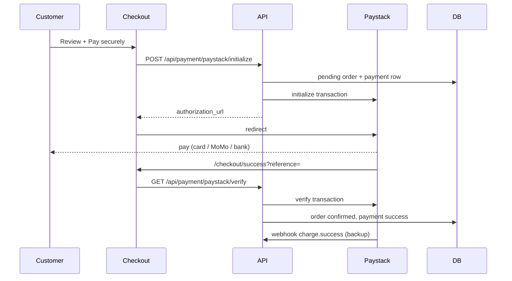

# Phase 4 — Checkout & Paystack ✅

## Environment

Add to `.env.local`:

```env
NEXT_PUBLIC_PAYSTACK_PUBLIC_KEY=pk_test_...
PAYSTACK_SECRET_KEY=sk_test_...
NEXT_PUBLIC_APP_URL=http://localhost:3000
SUPABASE_SERVICE_ROLE_KEY=...   # required for payment records + order fulfillment
```

## Paystack dashboard setup

1. **API Keys** — Dashboard → Settings → API Keys & Webhooks
2. **Webhook URL** (production):  
   `https://your-domain.com/api/payment/paystack/webhook`  
   Subscribe to `charge.success`
3. **Callback** — handled automatically via initialize (`/checkout/success`)

## Payment flow



## Routes

| Route | Description |
|-------|-------------|
| `/checkout` | 3-step checkout (shipping → payment → review) |
| `/checkout/success` | Paystack return + verification |
| `POST /api/payment/paystack/initialize` | Create pending order + start Paystack |
| `GET /api/payment/paystack/verify` | Verify reference after redirect |
| `POST /api/payment/paystack/webhook` | Paystack webhook (signature verified) |

## Payment methods

- **Paystack** (default) — card, mobile money, bank via Paystack hosted page
- **Cash on delivery** — order created immediately (no Paystack)

Legacy direct MoMo API routes remain for backward compatibility but are not shown in checkout UI.

## Security

- Order totals are **recomputed server-side** from database product prices
- Webhook requests require valid `x-paystack-signature` (HMAC SHA512)
- Payment fulfillment is **idempotent** (safe if verify + webhook both run)

## Test checklist

- [ ] Paystack test keys in `.env.local`
- [ ] Guest checkout → Paystack test card → success page → track order
- [ ] Logged-in checkout → Paystack → `/orders/[id]`
- [ ] COD order without Paystack
- [ ] Webhook receives `charge.success` in Paystack dashboard logs
- [ ] `payments` row shows `success` and order `confirmed`

## Next: Phase 5

See [PHASE_5_SMS.md](./PHASE_5_SMS.md) — BMS/mNotify SMS is implemented.
